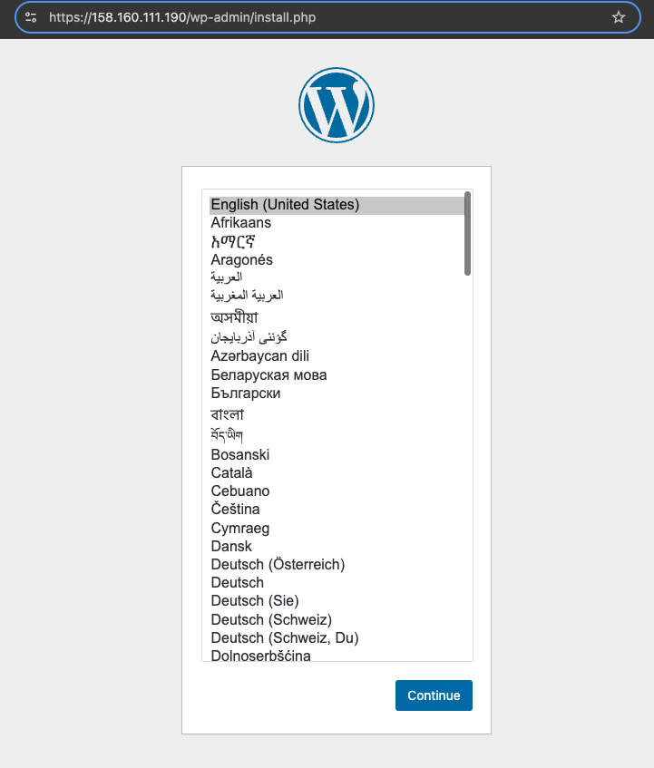
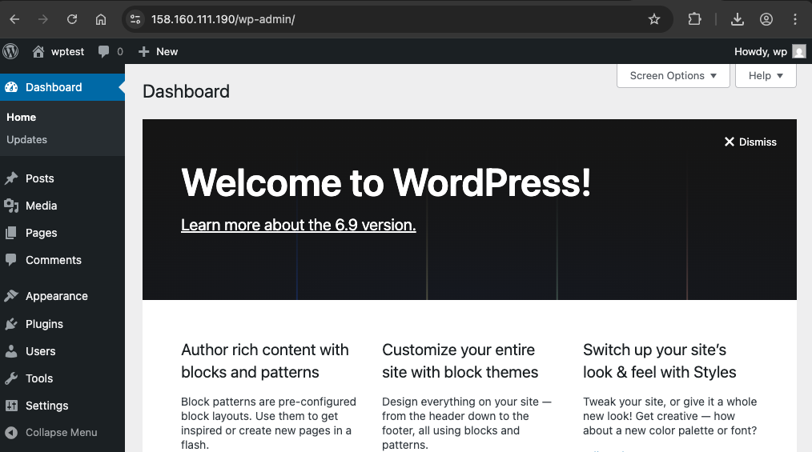

# Установка wp в docker и подключение к нему angie
```console
root@docker-wordpress:/etc/angie# docker ps  -a
CONTAINER ID   IMAGE              COMMAND                  CREATED             STATUS             PORTS                                     NAMES
ae8fa495a32c   wordpress:latest   "docker-entrypoint.s…"   About an hour ago   Up About an hour   0.0.0.0:8080->80/tcp, [::]:8080->80/tcp   wordpress_wordpress_1
53e160920723   mysql:5.7          "docker-entrypoint.s…"   About an hour ago   Up About an hour   3306/tcp, 33060/tcp                       wordpress_db_1
---------------------------------------------------------
root@docker-wordpress:/opt/wordpress# angie -v
Angie version: Angie/1.10.3
---------------------------------------------------------
root@docker-wordpress:/etc/angie# systemctl status angie.service
● angie.service - Angie - high performance web server
     Loaded: loaded (/usr/lib/systemd/system/angie.service; enabled; preset: enabled)
     Active: active (running) since Tue 2025-12-09 18:34:47 UTC; 33min ago 
---------------------------------------------------------
root@docker-wordpress:/etc/angie# tree
.
├── angie.conf
├── fastcgi.conf
├── fastcgi_params
├── http.d
│   ├── default.conf
│   └── wordpress.conf
├── mime.types
├── modules -> /usr/lib/angie/modules
├── prometheus_all.conf
├── scgi_params
├── ssl
│   ├── wordpress.key
│   └── wordpress.pem
├── stream.d
│   └── example.conf
└── uwsgi_params
-------------------------------------------------------
root@docker-wordpress:/opt/wordpress# curl -I http://127.0.0.1:8080
HTTP/1.1 302 Found
Date: Tue, 09 Dec 2025 19:17:46 GMT
Server: Apache/2.4.65 (Debian)
X-Powered-By: PHP/8.3.28
Expires: Wed, 11 Jan 1984 05:00:00 GMT
Cache-Control: no-cache, must-revalidate, max-age=0, no-store, private
X-Redirect-By: WordPress
Location: http://127.0.0.1:8080/wp-admin/install.php
Content-Type: text/html; charset=UTF-8
-------------------------------------------------------
```
#Далее обратилась к https://158.160.111.190 , получила редирект на страницу установки и установила CMS.



