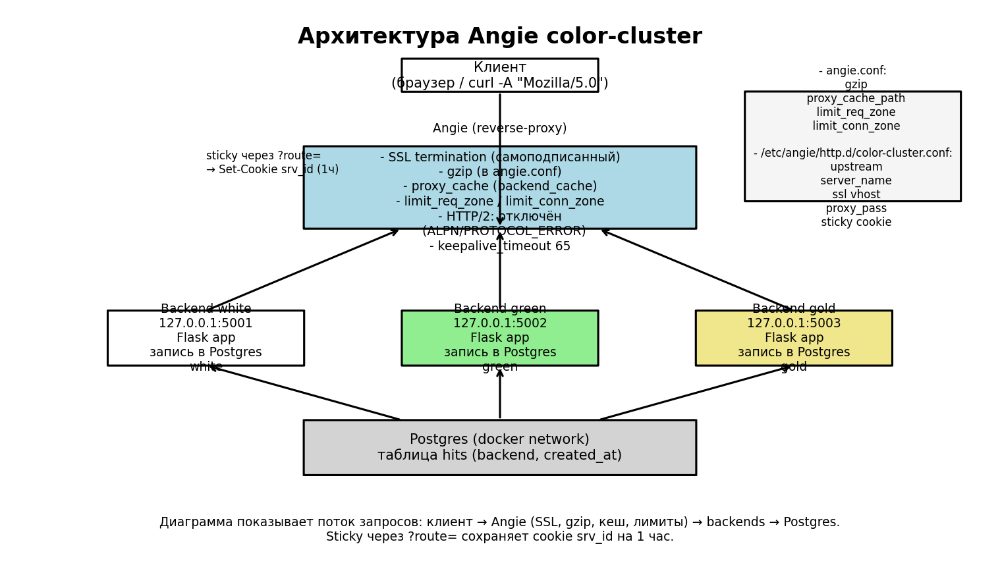
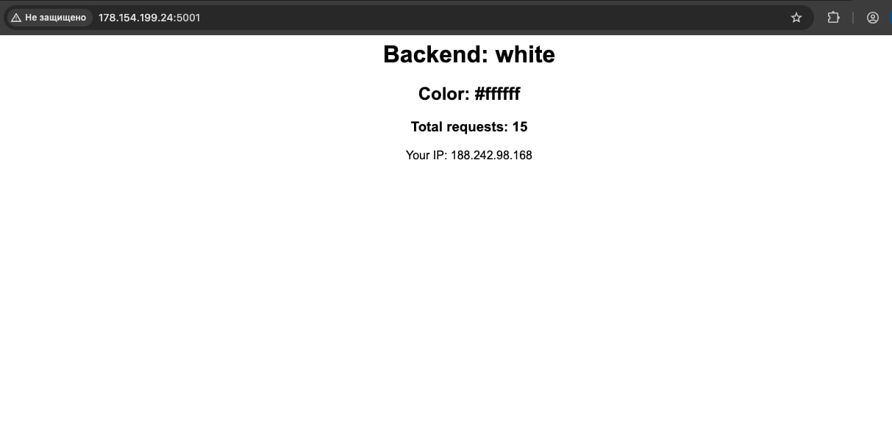
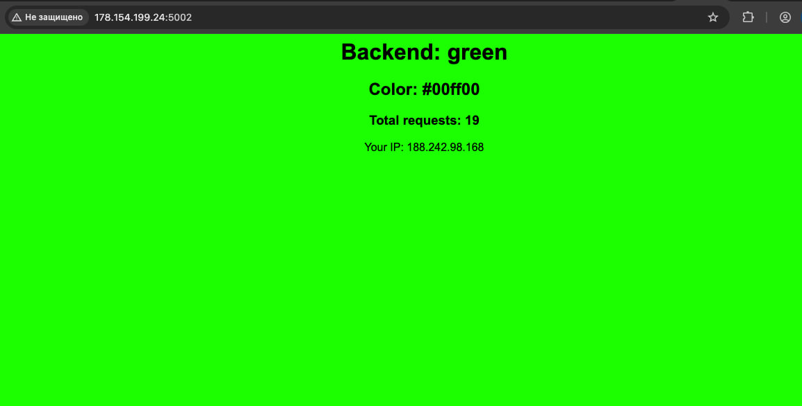
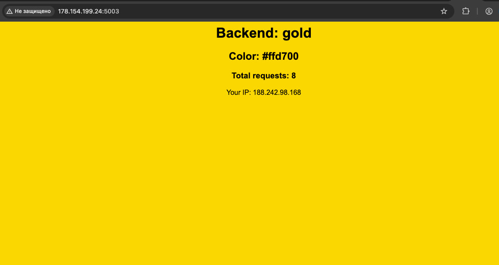

### Подготовка окружения
Angie установлен в систему на виртуальной машине, бекенд будет в docker, с контейнерами будет взаимодействовать БД на postgres.
1. Созданы директории для приложения в /opt/:
```console
root@angie-color-cluster:~# tree /opt/
/opt/
├── color-backends
│   ├── gold
│   ├── green
│   └── white
├── color-db
└── containerd
    ├── bin
    └── lib

9 directories, 0 files
```
2. Установлен postgres в docker и создана таблица для записи имени бекенда и его подключений.
Это нужно чтобы хранить описание цветовых бекендов, а также связать логику приложения и sticky‑маршрут.
```console
root@angie-color-cluster:~# docker ps -a
CONTAINER ID   IMAGE         COMMAND                  CREATED              STATUS              PORTS                                         NAMES
469fd380b49a   postgres:15   "docker-entrypoint.s…"   About a minute ago   Up About a minute   0.0.0.0:5432->5432/tcp, [::]:5432->5432/tcp   color-postgres
root@angie-color-cluster:~# docker exec -ti color-postgres psql -U postgres -d color -c "CREATE TABLE hits(id SERIAL PRIMARY KEY, backend TEXT, created_at TIMESTAMP DEFAULT now());"
CREATE TABLE
-----------
root@angie-color-cluster:~# angie -v
Angie version: Angie/1.11.3
root@angie-color-cluster:~# ss -tlnp | grep ':80'
LISTEN 0      511          0.0.0.0:80         0.0.0.0:*    users:(("angie",pid=4424,fd=6),("angie",pid=4423,fd=6),("angie",pid=4422,fd=6))
```

3. Созданы три одинаковых контейнера, отличающихся только цветом страницы, названием backend, значением, которое они пишут в БД.
Каждый backend будет слушать порт 5000 внутри контейнера, принимать запросы, делать INSERT в таблицу hits, выводить HTML с цветом, названием и количеством запросов.
Также создана общая docker сеть, чтобы контейнер определял по имени БД.
```console
root@angie-color-cluster:~# docker network create color-backends_color-net
root@angie-color-cluster:~# docker network ls
NETWORK ID     NAME                       DRIVER    SCOPE
9980c8129242   bridge                     bridge    local
fda1d50a65ee   color-backends_color-net   bridge    local
a1b32861e20d   host                       host      local
349a9621b395   none                       null      local
```
Логику работы бекендов обеспечивает /opt/color-backends/docker-compose.yml и /opt/color-backends/app.py, они представлены в репозитории.

4. Настройка Angie:
   - upstream на три backend‑контейнера
Создаётся пул из трёх backend‑сервисов (white, green, gold).
Angie распределяет запросы между ними и обеспечивает отказоустойчивость..

   - sticky‑маршрутизация по параметру ?route=
Если пользователь передаёт параметр ?route=white, Angie сохраняет его в cookie srv_id.
Cookie действует 1 час, и пользователь всегда попадает на выбранный backend.
Если параметра нет — cookie не создаётся, работает обычная балансировка.

   - HTTPS самоподписанный
Сертификат создан через OpenSSL.
HTTPS обеспечивает шифрование трафика и демонстрирует навыки настройки SSL.

   - DoS‑защита (limit_req, limit_conn)
Ограничение количества запросов и соединений от одного клиента.
Защищает от флуда и простейших атак.

   - оптимизация (gzip, HTTP/2, keepalive, кеширование)
gzip вынесен в главный конфиг angie.conf и включён глобально для текстовых и JSON‑ответов. Это уменьшает объём передаваемых данных и ускоряет загрузку страниц, при этом настройка централизована и не дублируется в каждом vhost.

HTTP/2 временно отключён в vhost из‑за проблем с ALPN/HTTP2 в текущем билде Angie (при тестах наблюдались PROTOCOL_ERROR и несогласование ALPN). Для стабильности оставлен HTTP/1.1; при необходимости включим HTTP/2 после проверки поддержки nghttp2/ALPN в бинарнике и пересборки/переустановки пакета.

keepalive_timeout 65; оставлен для уменьшения накладных расходов на установку TCP‑соединений — клиенты могут переиспользовать одно соединение для нескольких запросов.

proxy_cache объявлен в angie.conf (зона backend_cache) и используется в vhost для кеширования успешных ответов backend на 1 минуту. Это снижает нагрузку на приложения и базу данных и ускоряет отдачу повторяющихся запросов; при отладке кеш можно временно отключать в vhost.

### Архитектура и скриншоты



##### Как выглядит ответ от бекенда в браузере:

  
*Backend: white — страница бекенда, цвет #ffffff, счётчик запросов.*

  
*Backend: green — страница бекенда, цвет #00ff00, счётчик запросов.*

  
*Backend: gold — страница бекенда, цвет #ffd700, счётчик запросов.*

### Тестирование
Все тесты запускаются локально, с ноутбука.

1. Тест редиректа HTTP → HTTPS:
```console
$  curl -I -A "Mozilla/5.0" http://158.160.79.161
HTTP/1.1 301 Moved Permanently
Server: Angie/1.11.3
Date: Wed, 11 Mar 2026 18:40:25 GMT
Content-Type: text/html
Content-Length: 169
Connection: keep-alive
Location: https://158.160.79.161/
```
Вижу 301 Moved Permanently и смену http на https, значит работает.

2. Тест доступности HTTPS
```console
 $ curl -k -I -A "Mozilla/5.0" https://158.160.79.161
HTTP/1.1 200 OK
Server: Angie/1.11.3
Date: Wed, 11 Mar 2026 18:41:21 GMT
Content-Type: text/html; charset=utf-8
Content-Length: 251
Connection: keep-alive
```
Проверяю, что HTTPS‑виртуальный хост отвечает. Вижу HTTP/1.1 200 OK - работает.
Сертификат самоподписной, поэтому флаг -k в тестах.

3. Sticky‑маршрутизация по параметру ?route=

При отладке и тестировании я встретилась с проблемой, когда add_header был завернут в if и не были проставленыы приоритеты (arg -> cookie).
Это  приводило к непредсказуемому поведению.
В качестве решения из if был вынесен add_header, добавлены map‑правила с приоритетом ?route -> cookie -> пул.
Теперь первый запрос с ?route= сразу попадает на нужный backend, а последующие закрепляются по cookie.

Проверяю поход к конкретному бекенду через параметр route и смотрю запись куки:
```console
 $ curl -k -v -A "Mozilla/5.0" -c cookies.txt "https://158.160.79.161/?route=gold"
> GET /?route=gold HTTP/1.1
> Host: 158.160.79.161
> User-Agent: Mozilla/5.0
> Accept: */*
>
* Request completely sent off
< HTTP/1.1 200 OK
< Server: Angie/1.11.3
< Date: Thu, 12 Mar 2026 18:05:31 GMT
< Content-Type: text/html; charset=utf-8
< Content-Length: 251
< Connection: keep-alive
* Added cookie srv_id="gold" for domain 158.160.79.161, path /, expire 1773342331
< Set-Cookie: srv_id=gold; Path=/; Max-Age=3600; Domain=158.160.79.161; Secure; HttpOnly; SameSite=Lax
<

    <html>
    <body style="background:#ffd700; font-family:Arial; text-align:center;">
        <h1>Backend: gold</h1>
        <h2>Color: #ffd700</h2>
        <h3>Total requests: 41</h3>
        <p>Your IP: 172.19.0.1</p>
    </body>
    </html>
-------------------
 $ cat cookies.txt
# Netscape HTTP Cookie File
# https://curl.se/docs/http-cookies.html
# This file was generated by libcurl! Edit at your own risk.

#HttpOnly_158.160.79.161	FALSE	/	TRUE	1773342331	srv_id	gold
```
Кука успешно установлена - Set-Cookie: srv_id=gold, указан домен хоста - ip и заголовки безопасности.
В ответе от бекенда "Backend: gold"
Проверяю, что cookie сохраняется и закрепляет пользователя. Второй запрос, с отправкой полученной cookie:
```console
 $ curl -k -v -A "Mozilla/5.0" -b cookies.txt "https://158.160.79.161/"
> GET / HTTP/1.1
> Host: 158.160.79.161
> User-Agent: Mozilla/5.0
> Accept: */*
> Cookie: srv_id=gold
>
* Request completely sent off
< HTTP/1.1 200 OK
< Server: Angie/1.11.3
< Date: Thu, 12 Mar 2026 18:12:18 GMT
< Content-Type: text/html; charset=utf-8
< Content-Length: 251
< Connection: keep-alive
<

    <html>
    <body style="background:#ffd700; font-family:Arial; text-align:center;">
        <h1>Backend: gold</h1>
        <h2>Color: #ffd700</h2>
        <h3>Total requests: 43</h3>
        <p>Your IP: 172.19.0.1</p>
    </body>
    </html>
------------
188.242.98.168 - - [12/Mar/2026:18:12:18 +0000] "GET / HTTP/1.1" 200 251 "-" "Mozilla/5.0" upstream="127.0.0.1:5003" upstream_status="200" upstream_time="0.010" backend="-"
-------------
 $ curl -s -k -A "Mozilla/5.0" -c cookies.txt "https://158.160.79.161/?route=gold" > /dev/null
loomee@~ $
 $ seq 1 5 | xargs -I{} sh -c 'echo "$(date +"%T") -> $(curl -s -k -A "Mozilla/5.0" -b cookies.txt "https://158.160.79.161/" | sed -n "s/.*<h1>Backend: \([^<]*\)<\/h1>.*/\1/p")"; sleep 1'
21:44:30 -> gold
21:44:31 -> gold
21:44:33 -> gold
21:44:34 -> gold
21:44:35 -> gold
```
Повторный запрос с -b cookies.txt, в котором лежит gold,  возвращает страницу того же backend. В логе вижу "upstream="127.0.0.1:5003" - gold.
Ключ -b в curl позволяет отправить серверу cookie, это имитация браузера.
Тест показал, что sticky работает — клиент закрепляется за выбранным backend.

Если запустить запрос с некорректным route, то какое было NAME так и запишется в куки:
```console
 $ curl -k -v -A "Mozilla/5.0" -c cookies.txt "https://158.160.79.161/?route=grold"
* Added cookie srv_id="grold" for domain 158.160.79.161, path /, expire 1773343146
< Set-Cookie: srv_id=grold; Path=/; Max-Age=3600; Domain=158.160.79.161; Secure; HttpOnly; SameSite=Lax
        <h1>Backend: white</h1>
```
А бекенд будет отдан первый из пула бекендов по логике round‑robin, в данном случае - белый.

4. Поведение при блокировке User‑Agent
В конфигурации сайта есть фильтр по UA, который возвращает 444 для простых ботов (curl, python и т.д.).
```console
 $ curl -k  -I "https://158.160.79.161/"
curl: (52) Empty reply from server
```
Такие запросы сразу отвергаются сервером, закрывая соединение.

5. Простой тест показывающий работу дефолтного балансировщика round-robin. Несколько последовательных запросов с выводом тела из HTML:
```console
$ seq 1 5 | xargs -I{} sh -c 'echo "$(date +"%T") -> $(curl -s -k -A "Mozilla/5.0" "https://158.160.79.161/")"; sleep 1'
```console
 $ seq 1 5 | xargs -I{} sh -c 'echo "$(date +"%T") -> $(curl -s -k -A "Mozilla/5.0" "https://158.160.79.161/" | sed -n "s/.*<h1>Backend: \([^<]*\)<\/h1>.*/\1/p")"; sleep 1'
21:41:20 -> gold
21:41:21 -> white
21:41:22 -> green
21:41:23 -> green
21:41:24 -> gold
```

6. Нагрузочное тестирование.

##### ab — простой прогон с 100 параллельными соединениями, 1000 запросов. Показывает среднюю пропускную способность,
задержку, число неудачных запросов и распределение времени обработки.
```console
$ ab -k -n 1000 -c 100 -H "User-Agent: Mozilla/5.0" "https://158.160.79.161/"
This is ApacheBench, Version 2.3 <$Revision: 1913912 $>
Copyright 1996 Adam Twiss, Zeus Technology Ltd, http://www.zeustech.net/
Licensed to The Apache Software Foundation, http://www.apache.org/

Benchmarking 158.160.79.161 (be patient)
Completed 100 requests
Completed 200 requests
Completed 300 requests
Completed 400 requests
Completed 500 requests
Completed 600 requests
Completed 700 requests
Completed 800 requests
Completed 900 requests
Completed 1000 requests
Finished 1000 requests


Server Software:        Angie/1.11.3
Server Hostname:        158.160.79.161
Server Port:            443
SSL/TLS Protocol:       TLSv1.2,ECDHE-RSA-CHACHA20-POLY1305,2048,256
Server Temp Key:        ECDH X25519 253 bits

Document Path:          /
Document Length:        252 bytes

Concurrency Level:      100
Time taken for tests:   0.555 seconds
Complete requests:      1000
Failed requests:        985
   (Connect: 0, Receive: 0, Length: 985, Exceptions: 0)
Non-2xx responses:      977
Keep-Alive requests:    1000
Total transferred:      339763 bytes
HTML transferred:       174809 bytes
Requests per second:    1801.83 [#/sec] (mean)
Time per request:       55.499 [ms] (mean)
Time per request:       0.555 [ms] (mean, across all concurrent requests)
Transfer rate:          597.85 [Kbytes/sec] received

Connection Times (ms)
              min  mean[+/-sd] median   max
Connect:        0   15  44.2      0     172
Processing:    18   24   7.8     23      96
Waiting:       18   24   7.7     23      96
Total:         18   39  47.2     23     248

Percentage of the requests served within a certain time (ms)
  50%     23
  66%     24
  75%     25
  80%     26
  90%    150
  95%    176
  98%    183
  99%    198
 100%    248 (longest request)
```
Смотрю на строки:
```console
Requests per second:    1801.83 [#/sec] (mean)   - высокая средняя RPS

Failed requests:        985
Non-2xx responses:      977                      -  большинство запросов не получили ожидаемое тело/длину

Time per request:       55.499 [ms] (mean)       - средняя задержка удовлетворительна, но большое число failed,
что  говорит о проблеме с длиной ответа (Length: 985) — часто ab считает ответ «неправильным», если длина тела отличается от ожидаемой (Document Length)
```
Запустила агрузку wrk так:
wrk -t2 -c40 -d60s -H 'User-Agent: Mozilla/5.0' 'https://158.160.79.161/'

Но сервер в текущей конфигурации не выдерживает: не успевает писать в базу данных, утилизирует все CPU, 
Angie и бэкенды нагрузили  ресурсы, часть запросов стала возвращать 503 (upstream="-") — прокси не успевает или не может открыть соединения к upstream.

6. Описание тестирования в браузере:
- Перешла в браузере на https://158.160.79.161/. Страница должна отдаваться по HTTPS и показывать один из трёх цветов (white, green, gold) 
в зависимости от backend, на который попал запрос.
- При добавлении параметра ?route=white https://158.160.79.161/?route=white (или green, gold) браузер должен получить Set-Cookie: srv_id=<name> 
и при последующих запросах оставаться закреплённым за выбранным backend в течение часа.

Что проверять в браузере:
- цвет фона страницы соответствует выбранному backend
- текст страницы содержат имя backend и цвет
- счётчик Total requests увеличивается при каждом обращении (это подтверждает, что backend записывает в БД).

Счётчики на страницах демонстрируют, что запросы доходят до конкретного backend и записываются в БД — это удобно для проверки балансировки,
sticky‑маршрутизации и корректности работы приложения под нагрузкой. 
Счётчики помогают визуально убедиться в распределении нагрузки и в том, что кеширование/проксирование не мешают логике приложения.


